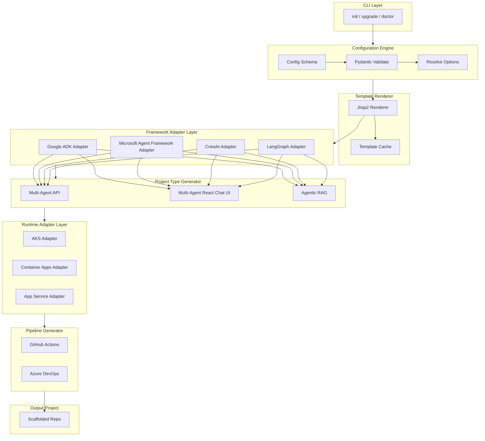

# Implementation Plan: Azure Agent Starter Pack CLI

**Branch**: `001-agent-scaffold-cli` | **Date**: 2025-02-25 | **Spec**: [spec.md](./spec.md)  
**Input**: Feature specification from `specs/001-agent-scaffold-cli/spec.md`

## Summary

Build a production-grade Azure-native CLI that scaffolds Azure AI Agent projects with configurable options. The CLI provides `init` and `upgrade` commands; supports frameworks (Google ADK, Microsoft Agent Framework, CrewAI, LangGraph); project types (Multi-Agent API, Multi-Agent React Chat UI, Agentic RAG); pipelines (GitHub Actions, Azure DevOps); runtimes (AKS, Container Apps, App Service); and IaC (Terraform, Bicep). Technical approach: Python 3.12+ with Typer, Pydantic, Jinja2, and Rich; layered architecture with Configuration Engine, Template Renderer, Framework Adapter Layer, Project Type Generator, Runtime Adapter Layer, and Pipeline Generator; deterministic output, template versioning, and phased rollout (MVP → Phase 2 → Phase 3).

## Technical Context

**Language/Version**: Python 3.12+  
**Primary Dependencies**: Typer (CLI), Pydantic (config validation), Jinja2 (template rendering), Rich (CLI UX), pytest (testing)  
**Storage**: Template cache (local/optional registry); no persistent DB for CLI itself  
**Testing**: pytest, snapshot/golden-file tests, CLI integration tests, Azure mocks  
**Target Platform**: Linux, macOS, Windows (developer workstations and CI)  
**Project Type**: CLI (library + entrypoint)  
**Performance Goals**: Init &lt;5 min, deployable output within 30 min  
**Constraints**: Deterministic generation; empty-dir or overwrite for init; cache-on-network-failure  
**Scale/Scope**: 4 frameworks × 3 project types × 2 pipelines × 3 runtimes × 2 IaC; extensible via adapters  

## Constitution Check

*GATE: Must pass before Phase 0 research. Re-check after Phase 1 design.*

Verify alignment with `.specify/memory/constitution.md`:

**Governing Principles**

- [x] **Azure-Native First**: Managed Identity, RBAC, Key Vault, Entra ID, Well-Architected — plan and templates enforce MI, Key Vault example, Azure OpenAI/Foundry wiring
- [x] **Production-Ready Defaults**: CI/CD, security scanning, observability, dev/stage/prod — pipeline generator and project types include all
- [x] **Golden Path**: Structured repo; separation of agent logic, orchestration, infra, pipelines — project type generators and runtime adapters enforce layout
- [x] **Secure-by-Default**: No hardcoded secrets; SAST, dependency scan, ZAP/DAST; env isolation — security model and pipeline generator mandate
- [x] **Extensible Plugin Architecture**: Framework and runtime adapter layers; future plugin ecosystem — adapter isolation and compatibility matrix
- [x] **Versioned Template System**: Template version metadata, backward-compatible upgrades, migration scripts — Template Versioning Strategy below
- [x] **Enterprise Readiness**: Dev/Stage/Prod, compliance-friendly patterns, documentation — runtime and pipeline design

**Architecture Standards**

- [x] **Separation of concerns**: Agent logic, orchestration, infra, pipelines — reflected in project type generators and output layout
- [x] **IaC required**: Bicep/Helm/YAML; no manual-only deployment — runtime adapters emit Bicep/Helm/containerapp YAML
- [x] **No hardcoded secrets**: Key Vault / Managed Identity / env vars only — all templates and security model
- [x] **Dev/Stage/Prod**: Distinct configs and promotion path — pipeline generator and runtime configs
- [x] **Azure-optimized output**: Azure-native services in generated templates — all adapters inject Azure patterns

**Security Mandates**

- [x] **Managed Identity** for Azure resource access — every framework adapter and runtime adapter
- [x] **SAST and dependency scan** in pipeline — pipeline generator (Semgrep/Bandit, dependency scan)
- [x] **ZAP baseline or DAST example** for web/API scaffolds — security model and API project type
- [x] **Environment variable isolation** — config injection and Key Vault pattern
- [x] **mTLS** documented or exemplified for multi-service — React Chat UI project type (optional mTLS config)

**Developer Experience**

- [x] **One-command scaffolding**; clear CLI UX; **doctor** command; deterministic output; backward-compatible upgrades — spec and CLI architecture

**Non-Goals** (confirm out of scope)

- [x] Not a full provisioning engine; not low-code; not framework-specific lock-in — spec Out of Scope; plan supports all four frameworks

---

## 1. High-Level Architecture



**Frameworks supported in architecture**: Google ADK, Microsoft Agent Framework, CrewAI, LangGraph — each adapter feeds into Project Type Generator for Multi-Agent API, Multi-Agent React Chat UI, and Agentic RAG.

---

## 2. CLI Architecture — Technology Stack

| Component | Choice | Role |
|-----------|--------|------|
| Runtime | Python 3.12+ | CLI and adapter implementation |
| CLI framework | Typer | Subcommands, flags, help |
| Config validation | Pydantic | Schema for framework, project type, pipeline, runtime, IaC |
| Template engine | Jinja2 | Deterministic rendering of templates |
| CLI UX | Rich | Progress, tables, clear errors |
| Testing | pytest | Unit, snapshot, integration |

---

## 3. Framework Adapter Layer

Each adapter MUST: provide a working minimal example, include tests, support Multi-Agent + RAG project types, inject Azure Managed Identity pattern, support environment config injection.

### 3.1 Google ADK Adapter

- Dependency injection for Google ADK
- Azure OpenAI support via abstraction layer
- Agent registration structure
- Tool binding template
- Multi-agent orchestration wrapper
- Azure identity override module

### 3.2 Microsoft Agent Framework Adapter

- Azure AI Foundry integration
- Managed Identity configuration
- Agent composition scaffolding
- Memory + tool orchestration template
- Native Azure SDK integration
- Azure Monitor hooks

### 3.3 CrewAI Adapter

- Multi-agent role scaffolding
- Task definition templates
- Azure OpenAI binding
- RAG integration compatibility
- Async execution template

### 3.4 LangGraph Adapter

- Graph node scaffolding
- State management template
- Tool nodes
- RAG pipeline node
- Azure OpenAI configuration
- Streaming support

---

## 4. Project Type Generators

Each framework must be compatible with:

| Type | Description |
|------|-------------|
| **A) Multi-Agent API** | FastAPI backend, health endpoint, Swagger, OpenTelemetry, unit tests |
| **B) Multi-Agent React Chat UI** | React (Vite), Node BFF, Python Agent Service, JWT auth (Entra ID), optional mTLS config |
| **C) Agentic RAG with Azure AI Search** | Azure AI Search index template, embedding pipeline, chunking logic, retrieval chain, agent reasoning layer |

---

## 5. Runtime Adapter Plan

| Runtime | Artifacts | Notes |
|---------|-----------|--------|
| **AKS** | Helm charts, Kustomize overlays, HPA, Managed Identity binding, Azure Monitor integration |
| **Azure Container Apps** | containerapp.yaml, revision config, Dapr optional, MI support |
| **Azure App Service** | Bicep template, Web App config, startup config, app settings injection |

---

## 6. Pipeline Generator

Each framework/runtime combination must support:

- **GitHub Actions**: Build, unit tests, SAST (Semgrep or Bandit), dependency scan, Docker build, push to ACR, deploy to runtime
- **Azure DevOps**: Multi-stage YAML, artifact publishing, environment promotion, security scanning

---

## 7. Template Versioning Strategy

- Template version metadata embedded in templates and manifest
- CLI checks for updates (optional; can use cached)
- Backward-compatible upgrades; migration scripts for breaking changes
- Upgrade command: auto-merge for template-owned files; warn on conflicts (per spec clarifications)

---

## 8. Testing Strategy

- Unit tests per adapter (framework, runtime, pipeline)
- Snapshot tests for template generation (golden file comparison)
- CLI integration tests (init, upgrade, doctor)
- Azure mock tests where external calls are stubbed

---

## 9. Security Model

All frameworks must include in generated output:

- Managed Identity
- Key Vault example
- Dev/Stage/Prod separation
- OpenTelemetry exporter
- ZAP config for API
- SAST config in pipeline

---

## 10. Phased Rollout Plan

| Phase | Scope |
|-------|--------|
| **Phase 1 (MVP)** | Microsoft Agent Framework, LangGraph; Multi-Agent API; GitHub Actions; AKS runtime |
| **Phase 2** | CrewAI, Google ADK; React UI; Azure DevOps; Container Apps runtime |
| **Phase 3** | RAG automation, plugin ecosystem, template registry, upgrade intelligence |

---

## 11. Risk Analysis

| Risk | Mitigation |
|------|-------------|
| Framework API drift | Adapter isolation; compatibility matrix tests; versioned adapter contracts |
| Azure SDK version changes | Pin or range in generated projects; compatibility matrix |
| Template combinatorial explosion | Modular templates (base + framework + project type + runtime); snapshot validation |
| Cross-runtime inconsistencies | Shared runtime adapter interface; golden outputs per combination |

---

## 12. Deliverables (from this plan)

- **Architecture diagrams**: Mermaid high-level diagram above; CLI/module breakdown below
- **Module breakdown**: See Project Structure and execution flow
- **Framework adapter mapping**: Table below (Compatibility Matrix)
- **Compatibility matrix**: Framework × Project Type × Pipeline × Runtime (supported combinations per phase)
- **Execution flow**: init → Config → Template Renderer → Framework Adapter → Project Type → Runtime Adapter → Pipeline → Output
- **Task roadmap**: Phase 1/2/3 above; detailed tasks in `tasks.md` (from `/speckit.tasks`)
- **Timeline estimate**: Phase 1 MVP ~8–12 weeks; Phase 2 ~6–8 weeks; Phase 3 ~6+ weeks (order-of-magnitude)
- **Tradeoff analysis**: See Tradeoff Analysis section below

### Compatibility Matrix (Phase 1 MVP)

| Framework | Multi-Agent API | React Chat UI | Agentic RAG | Pipeline | Runtime |
|-----------|----------------|----------------|-------------|----------|---------|
| Microsoft Agent Framework | ✓ | — | ✓ | GitHub Actions | AKS |
| LangGraph | ✓ | — | ✓ | GitHub Actions | AKS |
| CrewAI | — | — | — | — | — |
| Google ADK | — | — | — | — | — |

Phase 2 adds CrewAI, Google ADK, React Chat UI, Azure DevOps, Container Apps. Phase 3 adds RAG automation, plugin ecosystem, template registry.

### Execution Flow (init)

1. **CLI** parses `init` + options (interactive or flags/env).
2. **Configuration Engine** validates and resolves (framework, project type, pipeline, runtime, IaC); fails fast on invalid combination; checks target dir empty or overwrite.
3. **Template Renderer** loads templates (from cache or network); if fetch fails and no cache, fail with clear error.
4. **Framework Adapter** selects adapter (Google ADK / Microsoft / CrewAI / LangGraph); injects framework-specific files and config.
5. **Project Type Generator** composes Multi-Agent API / React Chat UI / Agentic RAG layout and entrypoints.
6. **Runtime Adapter** emits IaC (Bicep/Helm/containerapp) and runtime config.
7. **Pipeline Generator** emits GitHub Actions or Azure DevOps YAML.
8. **Output**: Write all files deterministically to target directory.

### Tradeoff Analysis

| Decision | Tradeoff | Choice |
|----------|----------|--------|
| Python CLI | Ecosystem vs portability | Python 3.12+ for Typer/Pydantic/Jinja2 and Azure SDK support; single binary possible later |
| Adapter per framework | Consistency vs maintenance | One adapter per framework; isolate API drift; test via compatibility matrix |
| Template cache on network failure | UX vs simplicity | Use cache when available; fail clear when not — balances offline and correctness |
| Phased rollout | Time-to-MVP vs full matrix | MVP with 2 frameworks + API + AKS + GitHub Actions; expand in Phase 2/3 |
| Upgrade auto-merge | Safety vs convenience | Auto-merge template-owned files, warn on conflicts — per spec clarification |

---

## 13. Project Structure

### Documentation (this feature)

```text
specs/001-agent-scaffold-cli/
├── plan.md              # This file
├── research.md          # Phase 0
├── data-model.md        # Phase 1
├── quickstart.md        # Phase 1
├── contracts/           # Phase 1
└── tasks.md             # Phase 2 (/speckit.tasks)
```

### Source Code (repository root)

```text
src/
├── azure_agent_starter_pack/
│   ├── cli/                 # Typer app, init, upgrade, doctor
│   ├── config/              # Pydantic schemas, resolution
│   ├── render/              # Jinja2 renderer, template loader, cache
│   ├── adapters/
│   │   ├── framework/       # Google ADK, Microsoft, CrewAI, LangGraph
│   │   ├── project_type/    # Multi-Agent API, React UI, RAG
│   │   ├── runtime/         # AKS, Container Apps, App Service
│   │   └── pipeline/        # GitHub Actions, Azure DevOps
│   └── templates/           # Versioned template roots (or bundled)
tests/
├── unit/
│   ├── adapters/
│   └── cli/
├── integration/
│   └── cli/
├── snapshot/               # Golden output per combination
└── contract/
```

**Structure Decision**: Single Python package with clear separation: `cli`, `config`, `render`, and `adapters` (framework, project_type, runtime, pipeline). Templates may live inside package or in a separate versioned bundle; cache under user dir or project. Tests mirror structure with unit, integration, snapshot, and contract.

---

## Complexity Tracking

> No constitution violations. Plan aligns with all gates; no exceptions required.
